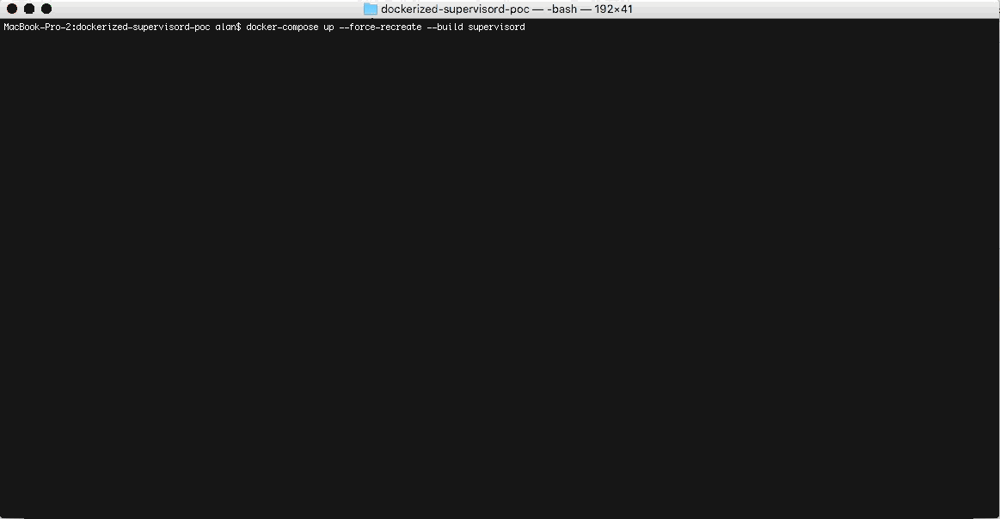

Dockerized SUPERVISOR
---------------------

Basically this POC is making `supervisord` - inside its own container - execute `command.php` script within another container and re-run this script each time it exits.

Requirements
------------

`docker` and `docker-compose` is required to run this example.

Run the example
---------------

`docker-compose up --force-recreate --build supervisord`

